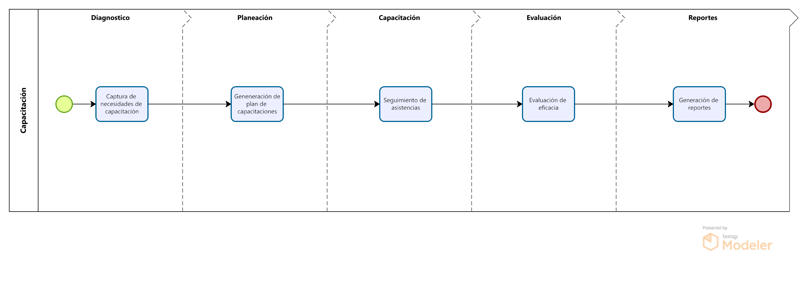

# Introducción

Al área de capacitación de Imbera a solicitado una propuesta que les permita sistematizar el procedo de identificación de necesidades de capacitación, planeación de curso, seguimiento de capacitaciones y generación de reportes incluyendo reportes entregados a al Secretaría de Trabajo

Hoy en día estas tareas se gestionan en archivos de trabajo, como libros de Excel y carpeta de que consolidan la información. Estos documentos han sido revisados y analizados en sesiones de trabajo con el área de Capacitación para determinar las características que debería tener una plataforma web que los sustituyera.

## Alcance de la propuesta

El presente documento contiene la propuesta de APSYS para el diseño, desarrollo e implementación de la plataforma de gestión de la capacitación que soporte las siguientes etapas y funcionalidades del proceso

- Diagnóstico de necesidades
- Planeación de cursos de capacitación
- Seguimiento a la capacitación
- Generación de reportes

