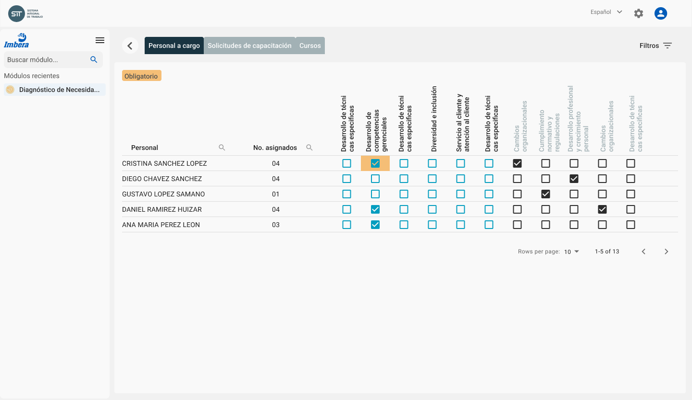
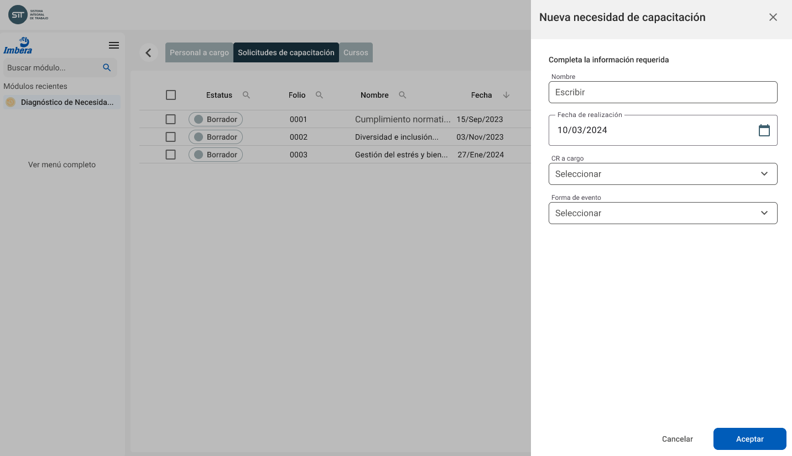
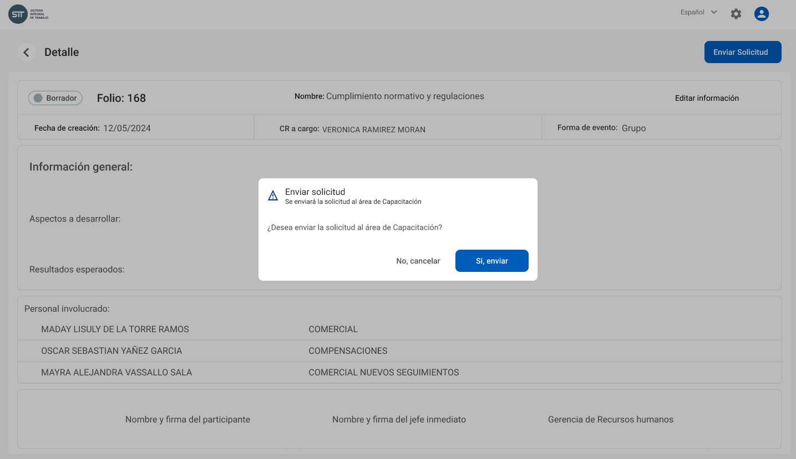

# Diagnóstico e identificación necesidades

El primer paso del proceso es el diagnóstico e identificación de las necesidades de capacitación del personal, realizado por cada **Responsable de área** en los periodos establecidos por el área de capacitación y/o durante el transcurso del año.

Este proceso es fundamental para entender y considerar las áreas de desarrollo de los empleados, asegurando que las iniciativas de capacitación estén alineadas con las necesidades reales y objetivos de la empresa.

## Personal a cargo

Cada **Responsable de área** tendrá acceso al listado del personal que tiene a su cargo y podrá consultar la relación de los cursos que han completado, esto con el objetivo de facilitar la identificación de necesidades de capacitaciones y realizar las [Solicitudes de capacitación](diagnostic#solicitud-de-capacitación) correspondientes.

Este acceso permite a los **Responsables de área** tomar decisiones informadas sobre el desarrollo profesional de su equipo, asegurando que las iniciativas de capacitación estén alineadas con las competencias necesarias para alcanzar los objetivos de la empresa.

:::info
La lista de empleados (_headcount_) que se muestra a los responsables de área será actualizada por **Capacitación** como se explica en la sección [Administración de la plataforma](administration)
:::

## Solicitud de capacitación

El **Responsable de área** podrá solicitar la capacitación de su personal a los cursos registrados por el área de **Capacitación**, o solicitar la inscripción a un nuevo curso.

Las solicitudes de capacitación podrán ser realizadas en cualquier momento, pero se concentrarán particularmente a finales de año cuando se realiza el proceso de identificación de necesidades de capacitación.

Estas solicitudes serán recibidas por el área de **Capacitación** para su evaluación, aprobación y posterior planeación en la agenda

