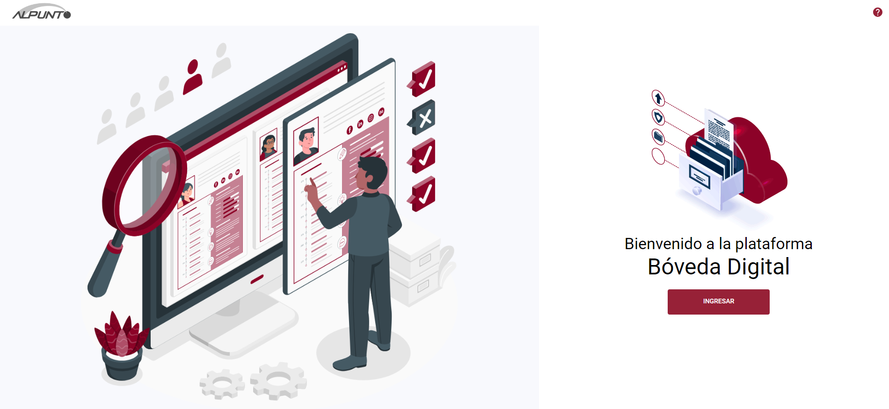

# Identificación necesidades

La identificación de las necesidades de capacitación será realizado por el **Responsable de Area** en los periodos de registros establecidos por el área de capacitación, y durante el transcurso del año

## Personal a cargo

Cada **Responsable de Area** que podrá ver el listado del personal que tiene a su cargo y la relación de los cursos que ha tomado cada uno de ellos

## Solicitud de curso

El **Responsable de Area** podrá solicitar la inscripción de su personal a los cursos registrados por el área de **Capacitación**, o solicitar la inscripción a un curso nuevo. Estas solicitudes serán recibidas por el área de **Capacitación** para su evaluación, aprobación y posterior agenda

[TODO: Imagen de la solicitud de capacitación]

## Bóveda digital

La plataforma sincronizará información con la plataforma de _Bóveda digital_ para mantener el catálogo de empleados actualizado

Los eventos que se monitorean son

- Alta de empleado
- Baja empleado
- Transferencia empleado

## Administración de cursos

La plataforma permite al área de **Capacitación** ver y mantener actualizado el catálogo de cursos que se ofrecen a los empleados. Estos cursos podrán ser agendados una o varias veces al año, con diferentes asistentes en cada ocasión

El área de **Capacitación** podrá agregar nuevos cursos en base a las solicitudes de capacitación enviadas por los **Responsables de área** o dar de baja aquellos que por alguna razón son considerados obsoletos

