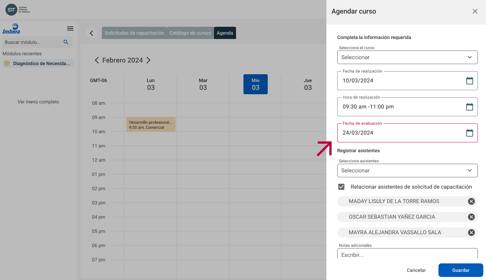

# Planeación de capacitación

## Revisión y autorización de solicitudes de capacitación

El personal del área de **Capacitación** revisa las solicitudes de capacitación enviadas por los **Responsables de área** para su evaluación y autorización.

Cada solicitud deberá contener la información del curso de capacitación solicitado, asistentes propuestos y detalles requeridos para su aprobación.

Estas solicitudes son revisadas y autorizadas por las personas pertinentes para que sean tomadas en cuenta en el proceso de planeación y calendarización

## Creación de agenda de capacitación

Una vez autorizadas las solicitudes, el área de **Capacitación** lleva a cabo una planificación detallada para asegurar la correcta impartición de los cursos. Este proceso incluye la determinación de fechas específicas para cada curso, la selección y asignación de instructores calificados y la coordinación logística de los asistentes.

La agenda de los cursos podrá ser asociada a una o varias solicitudes de capacitación y consultadas en un calendario para su seguimiento

## Planeación de la evaluación

Es importante determinar si la capacitación impartida ha cumplido sus objetivo, es por eso el el área de **Capacitación** establecerá una fecha _tentativa_ de evaluación para todos los cursos que ya cuenten son un espacio en la agenda

Esta evaluación será realizada por la persona que solicita la capacitación como se explica en la sección de [Evaluacion](evaluation)

## Envio de inscripción digital [Código QR]

Con la agenda de lo cursos creada, el área de **Capacitación** podrá notificar vía correo electrónico a cada asistente sobre su incripción con el detalle de las fechas, lugares y condiciones del curso.

Esta notificación contendrá un código _QR_ que facilitará el registros de la asistencia de los participantes como será explicado más adelante

