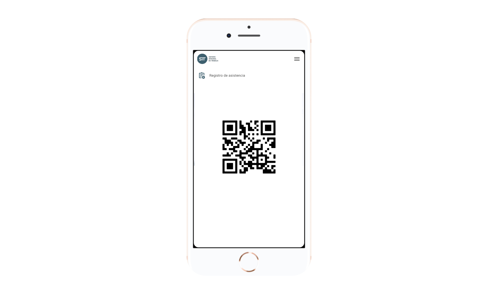

# Seguimiento a capacitación

## Mis cursos de capacitación

Cada **Empleado** con acceso a la plataforma, tendrá accesos a la agenda con sus cursos programados. Esta agenda le dará acceso a la información detallada de cada cursos, asi como a la impresión del código _QR_.

## Registro automatico de asistencia

El código _QR_ mencionado le permitirá al **Empleado** registrar sus asistencia pasado el código a través de un lector que identificará a la persona y al curso al que asiste. El _QR_ podrá ser mostrado en su teléfono móvil y bien directamente en una hoja impresa para tal fin

## Registro manual de asistencias

Para aquellos casos donde el **Empleado** no pueda registrar por si mismo su asistencia, el área de **Capacitación** podrá importar el listado de asistencias usando un archivo de texto.

## Resguardo de documentos

El área de **Capacitación** podrá subir archivos asociados a los cursos de capacitación, como listas de asistencia con firmas autógrafas

Tambien podrá abrir el perfil de un colaborador y anexar sus certificados o reconocimientos de participación en a los cursos que asistió

