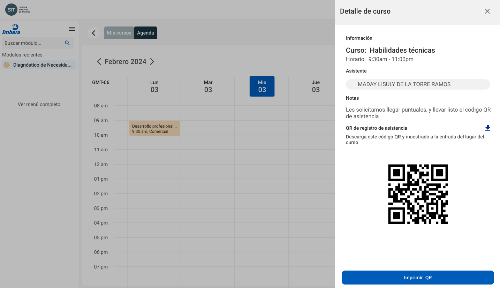

# Seguimiento a capacitación

## Mis cursos de capacitación

Cada **Empleado** con acceso a la plataforma tendrá la posibilidad de consultar su agenda personal con los cursos programados. Esta agenda le proporcionará información detallada sobre cada curso, incluyendo el contenido del curso, fechas y horarios, lugar de realización, e instructores asignados.

Además, desde la misma agenda, el empleado podrá generar e imprimir el código QR correspondiente a cada curso. Este código QR facilitará el acceso y la verificación de su asistencia, agilizando el proceso de registro y control durante la capacitación.

> _Las funcionalidades propuestas a continuación, basadas en el código QR están pendientes de revisión. Actualmente existen otros proyectos del área de RH que podrían sustituir la generación de este código_

## Registro automatico de asistencia

El código QR mencionado permitirá al **Empleado** registrar su asistencia al pasar el código a través de un lector que identificará a la persona y al curso al que asiste. Este código QR puede ser mostrado en su teléfono móvil o directamente en una hoja impresa, según sea más conveniente.

El uso del código QR agiliza significativamente el proceso de registro, eliminando la necesidad de métodos manuales y reduciendo el margen de error. Además, facilita el control de asistencia en tiempo real, permitiendo a los organizadores obtener datos precisos y actualizados sobre la participación de los empleados en los distintos cursos de capacitación.

## Registro manual de asistencias

En aquellos casos donde el **Empleado** no pueda registrar por sí mismo su asistencia, el área de **Capacitación** podrá importar el listado de asistencias utilizando un archivo de texto.

Este procedimiento manual asegura que ningún empleado se quede sin registrar su participación en los cursos de capacitación, manteniendo así la integridad y precisión de los registros de asistencia. El archivo de texto podrá contener la información necesaria para identificar a los empleados y los cursos a los que asistieron, facilitando su inclusión en la base de datos del sistema.

Esta alternativa manual complementa el proceso automatizado con códigos QR, proporcionando una solución flexible y completa para la gestión de asistencias, independientemente de las circunstancias.

## Resguardo de documentos

El área de **Capacitación** tendrá la capacidad de subir archivos asociados a los cursos de capacitación, como listas de asistencia con firmas autógrafas.

Además, podrán acceder al perfil de un empleado y adjuntar sus certificados o reconocimientos de participación en los cursos a los que asistió. Esta función permite mantener un registro completo y organizado de la formación recibida por cada empleado.

Este sistema de resguardo de documentos asegura la integridad y accesibilidad de la información relacionada con la capacitación, facilitando la revisión y verificación de los registros por parte de los empleados y los administradores del sistema.

