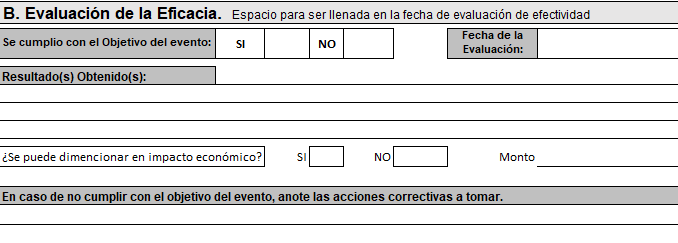

# Evaluación de la eficacia

El personal del área de _Capacitación_ podrá evaluar y registrar en la plataforma si la capacitación impartida tuvo la eficacia esperada creado un formato adicional como el que se muestra a continuación

La evaluación será solicitada para aquellos cursos que asi hayan sido determinados por el área de capacitación
