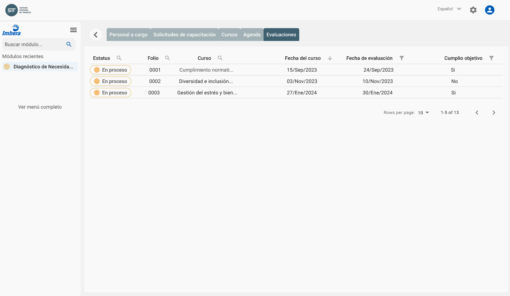
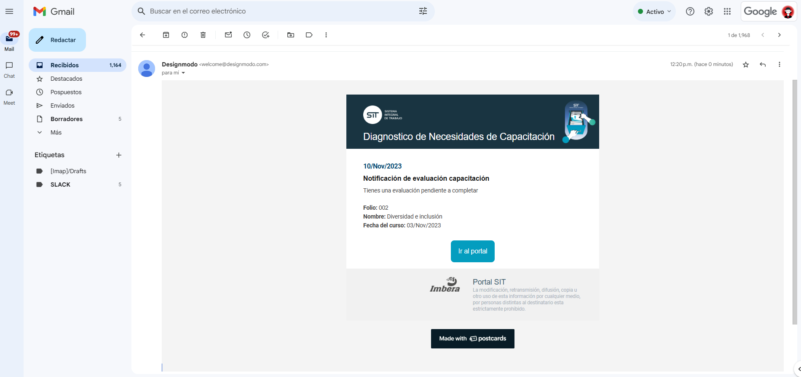
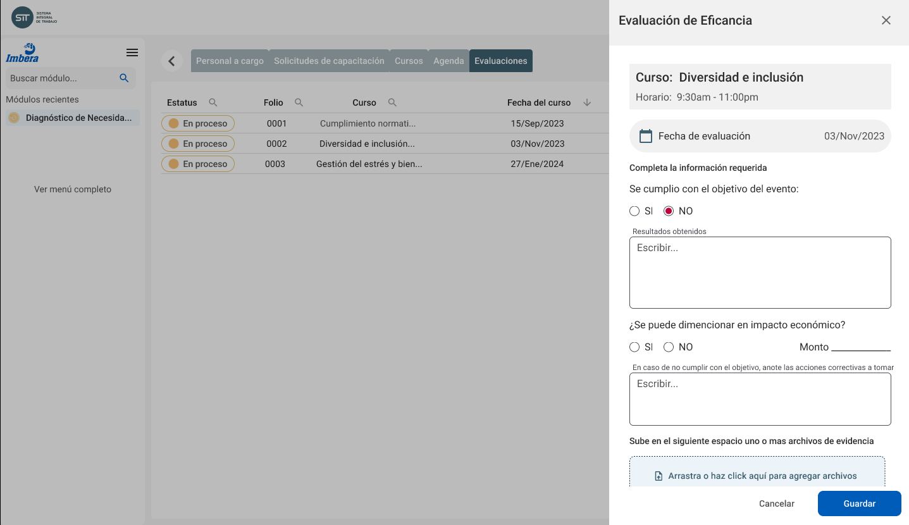

# Evaluación de la eficacia

La evaluación de la eficacia de una capacitación es un proceso crucial para asegurar que los objetivos de aprendizaje se han cumplido y que los participantes han adquirido las habilidades y conocimientos necesarios. Es por eso que la plataforma permitirá la evaluación y registros de evidencias como se explica a continuación

## Planeación de la evaluación

La planeación de las fechas de evaluación será realizada tentativamente por el área de **Capacitación** al momento de agendar los cursos en el calendario, como se explica en la sección de [Planeación de la evaluación](planning#planeación-de-la-evaluación).

Posteriormente, los **Responsables de área** podrán consultar las evaluaciones pendientes y _ajustar_ las fechas si fuera necesario.

Este enfoque asegura que las evaluaciones se programen de manera coordinada con la capacitación, permitiendo a los solicitantes ajustar sus compromisos de evaluación según las necesidades operativas.

## Notificaciones automatizadas

Con el fin de dar seguimiento a cada evaluación pendiente, la plataforma enviará recordatorios por correo electrónico a los **Responsables de área** y al área de **Capacitación**

Este sistema automatizado asegura que los encargados estén al tanto de las evaluaciones programadas y puedan tomar las acciones necesarias en tiempo y forma, mejorando la cumplimiento en el proceso de evaluación.

## Evaluación y carga de evidencias

Una vez impartido el curso y recopilada la evidencia, el **Responsable de área** será responsable de evaluar la eficacia del curso y subir evidencia que confirme los resultados de la capacitación. Esta evidencia puede incluir archivos de certificación, indicadores de desempeño u otros materiales relevantes.

Este proceso permite asegurar que cada curso de capacitación cumpla con los objetivos establecidos y contribuya realmente al desarrollo profesional de los empleados. Además, facilita la revisión y seguimiento en caso de que los objetivos no hayan sido alcanzados, permitiendo ajustes y mejoras continuas para optimizar el impacto de la formación dentro de la organización.

