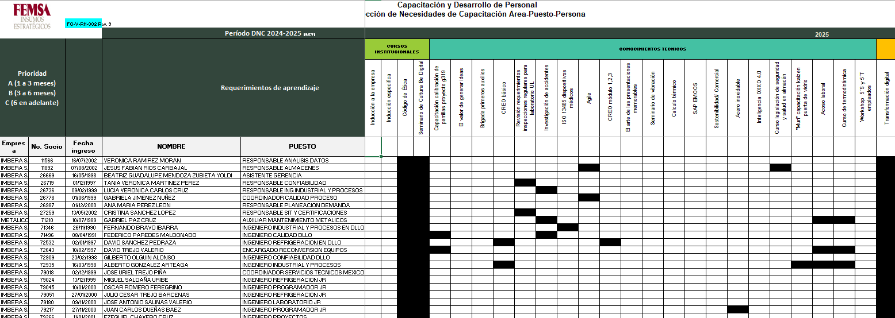
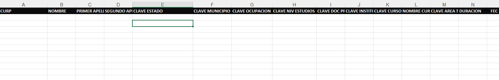

# Reportes y tableros

La plataforma contendrá los siguientes reportes y tableros que desplegará KPI's de seguimiento

## Matriz de dignóstico de capacitaciones

Este reporte contendrá la información que actualmente se consolida en el formato _FO-V-RH-002_ mostrado y explicado en las sesiones de análisis

## Reporte de Secretaría de Trabajo

El reporte de la _Secretaría de Trabajo_ descargará la información en un archivo como el que se muestra a continuación

### Administración de catálogos

Para la generación del reporte de la _Secretaría de Trabajo_ el área de **Capacitación** podrá actualizar los siguiente catálogos relacionados:

- Competencias
- Cursos
- Estados
- Estudios
- Modalidades
- Ocupaciones
- Tematicas
- TiposAgentes

## Reporte gerencial 01

- Duración
- Asistencia
- Horas hombre
- Personal programado
- Efectividad de la asistencia
- Instrucutor
- Total de participantes

## Reporte gerencial 02

- Participantes Imbera
- Participantes Metalicos
- Horas capacitación Imbera
- Horas capacitación Metalicos
- Total horas capacitación

## GRI

Ut aliquet nulla tincidunt interdum lobortis. Ut facilisis bibendum dignissim. Mauris vel erat nec metus posuere aliquam tristique ac metus. Vivamus pharetra mauris ex, et egestas lectus vestibulum nec. Donec ultricies pharetra eros non malesuada. Curabitur faucibus felis non diam venenatis, eu tincidunt urna bibendum. Proin vulputate lorem sit amet orci congue dapibus. Phasellus venenatis tempus libero, sed scelerisque tellus vulputate in. Vivamus euismod ultricies cursus. Morbi diam turpis, maximus et iaculis a, pharetra non libero.

- Promedio de horas de formación por empleado
- Horas de capacitación Mujer IMBERA
- Horas de capacitación Hombre IMBERA
- Promedio de horas de capacitación mujer IMBERA
- Promedio de horas de capacitación hombre IMBERA
- Horas de capacitación por categoría EMPLEADOS
- Horas de capacitación por categoría SINDICALIZADOS
- Promedio de horas de capacitación Empleados
- Promedio de horas de capacitación Sindicalizados
- Horas de capacitación presencial
- Horas de capacitación virtual
- Horas de capacitación en temas de salud y seguridad en el trabajo
- % de cobertura de capacitación en temas de seguridad
- Total horas capacitación
- % de trabajadores capacitados en temas de derechos humanos
- % de trabajadores capacitados en temas de Habilidades especializadas
- % de trabajadores capacitados en temas de Cultura y Liderazgo
- Personal capacitado en código de ética
- % de trabajadores capacitados en temas de Ética
- % de trabajadores de la organización que recibieron formación (interna o externa) sobre cuestiones medioambientales
