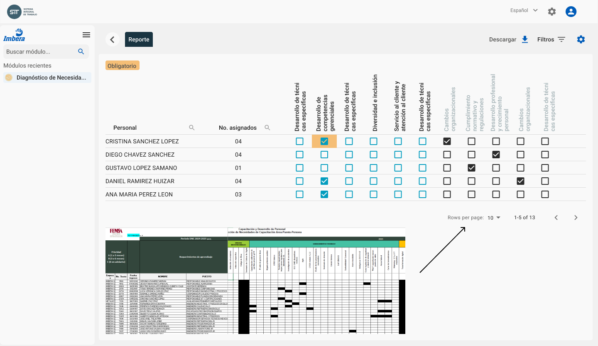

# Reportes y tableros

## Matriz de dignóstico de capacitaciones

Este reporte contiene la información que actualmente se consolida en el formato _FO-V-RH-002_, relacionando los empleados con los cursos de capacitación atendidos, los vigentes y los planeados

## Reporte de Secretaría de Trabajo

El área de **Capacitación** descarga el reporte de la _Secretaría de Trabajo_ que se muestra a continuación. Este reporte se genera automáticamente a partir de los cursos, reportes de asistencias y catálogos descritos en la parte inferior de este documento

### Administración de catálogos

Para la generación del reporte de la _Secretaría de Trabajo_ el área de **Capacitación** podrá actualizar los siguiente catálogos relacionados:

- Competencias
- Cursos
- Estados
- Estudios
- Modalidades
- Ocupaciones
- Tematicas
- TiposAgentes

## Reporte gerencial 01

El área de **Capacitación** descarga el reporte de la gerencial que se muestra a continuación. Este reporte se genera automáticamente a partir de los cursos, reportes de asistencias

- Duración
- Asistencia
- Horas hombre
- Personal programado
- Efectividad de la asistencia
- Instrucutor
- Total de participantes

## Reporte gerencial 02

- Participantes Imbera
- Participantes Metalicos
- Horas capacitación Imbera
- Horas capacitación Metalicos
- Total horas capacitación

## GRI

- Promedio de horas de formación por empleado
- Horas de capacitación Mujer IMBERA
- Horas de capacitación Hombre IMBERA
- Promedio de horas de capacitación mujer IMBERA
- Promedio de horas de capacitación hombre IMBERA
- Horas de capacitación por categoría EMPLEADOS
- Horas de capacitación por categoría SINDICALIZADOS
- Promedio de horas de capacitación Empleados
- Promedio de horas de capacitación Sindicalizados
- Horas de capacitación presencial
- Horas de capacitación virtual
- Horas de capacitación en temas de salud y seguridad en el trabajo
- % de cobertura de capacitación en temas de seguridad
- Total horas capacitación
- % de trabajadores capacitados en temas de derechos humanos
- % de trabajadores capacitados en temas de Habilidades especializadas
- % de trabajadores capacitados en temas de Cultura y Liderazgo
- Personal capacitado en código de ética
- % de trabajadores capacitados en temas de Ética
- % de trabajadores de la organización que recibieron formación (interna o externa) sobre cuestiones medioambientales
