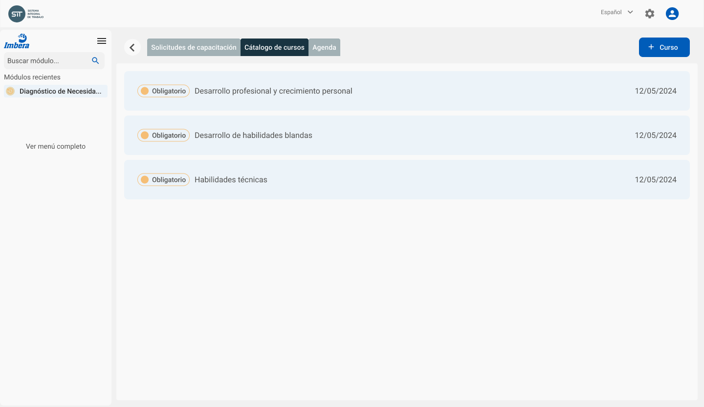
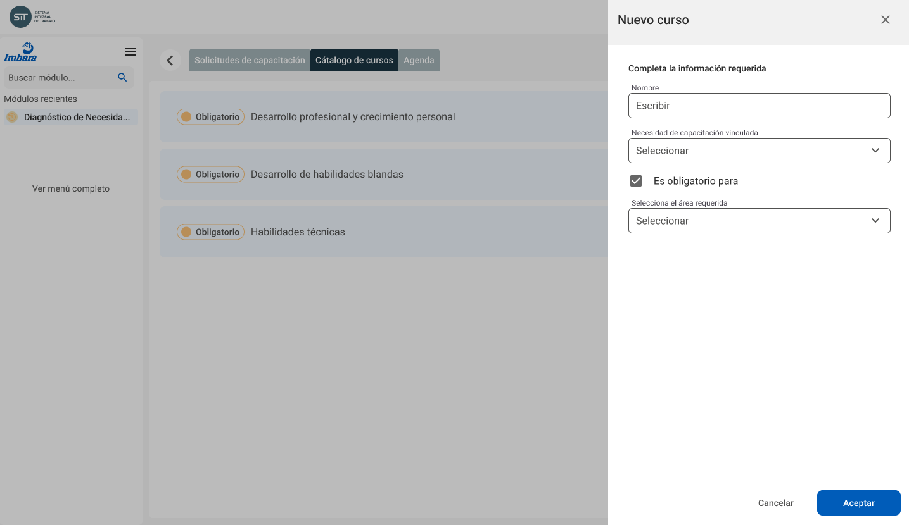

# Administración de la plataforma

El área de **Capacitación** tiene a su disposición dos herramientas de administración de la plataforma

## Administración de _headcount_

La plataforma obtendrá la información de los movimientos de empleados a partir de un archivo de texto cargado por el área de **Capacitación**:

- Alta de empleados
- Baja empleados
- Transferencia empleados

El archivo mencionado contiene la relación entre un colaborador y su **Responsable de Area**

## Administración de cursos

El área de **Capacitación** mantiene actualizado el catálogo de cursos que se ofrecen a los empleados, agregando los nuevos cursos o dando de baja aquellos que por alguna razón son considerados obsoletos

> Estos cursos podrán ser agendados una o varias veces al año, con diferentes asistentes, instructores o condiciones en cada ocasión
